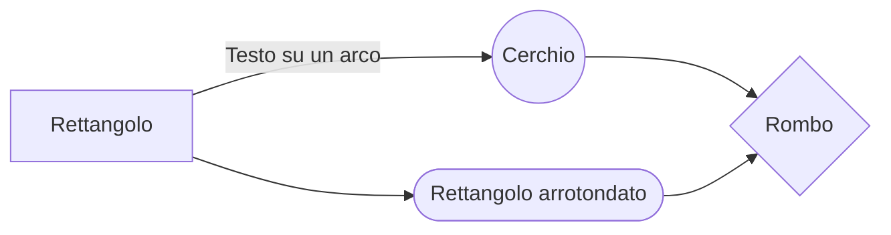

# Esercizio 4
Ricerca come è possibile realizzare semplici flow-char come il seguente:

```mermaid
graph LR
A[Rettangolo] -- Testo su un arco --> B((Cerchio))
A --> C([Rettangolo arrotondato])
B --> D{Rombo}
C --> D
```
